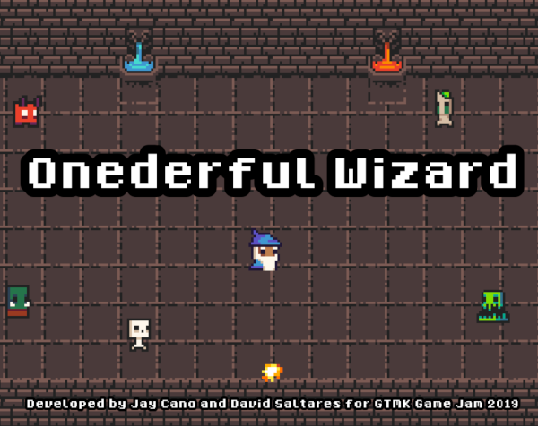

# Onederful Wizard

[GMTK Game Jam 2019](https://itch.io/jam/gmtk-2019) entry made with
[Godot Engine](https://godotengine.org/).

[Play it on your browser!](https://david-saltares.itch.io/onederfulwizard)

### Intro

It's dark and damp in this dungeon, but luckily you are a powerful wizard and know your spells.
You can cast a magnificent fireball, to light your way, vanquish enemies and keep you warm.

Oh, wait! It's just you. I guess you can call that a fireball, having to go and fetch it every
time you cast is not ideal, but it's something. Hopefully it will be enough, this dungeon is
closed off with magic doors and there are fearsome monsters crawling in the dark. Good luck!
You'll definitely need it.

### GMTK Game Jam 2019

The theme of this game jam is "Only One", so we created a game where you have only one shot
to solve all the puzzles and defeat all the enemies. After casting the spell, you will have
to go a fetch it again so you can keep going.

There is:

* One wizard
* One spell
* One exit
* One screen

### License

The code is distributed under the [Apache License](./LICENSE). The [game assets](./assets_used.md)
are re-used and each pack may have different license agreements.
